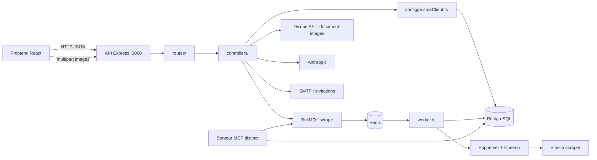
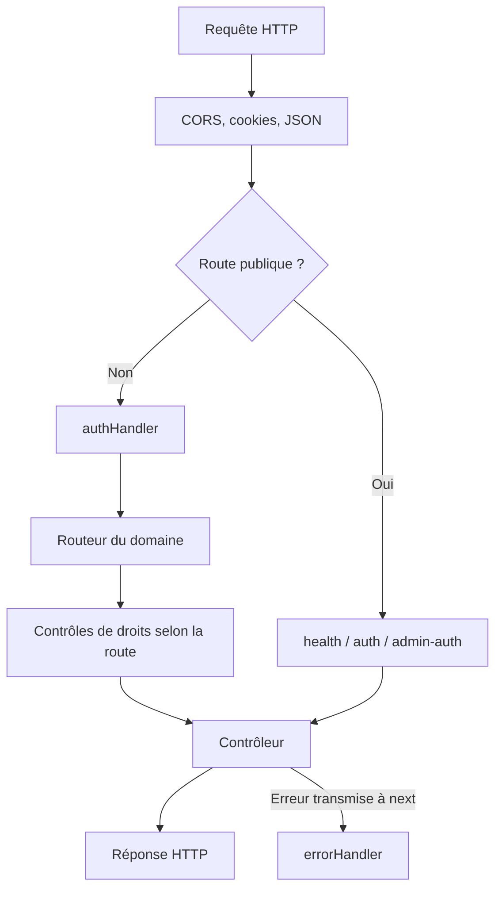

# Architecture de l’API

L’API Express et le worker sont deux processus distincts. Ils utilisent PostgreSQL via Prisma et partagent la file BullMQ `scrape` dans Redis.

## Parcours d’une requête

`/auth/me`, `/auth/change-password` et `/api/admin-auth/invite` appliquent leur propre middleware d’authentification. Le middleware global autorise aussi l’accès sans jeton à un document public via `/api/documents/:id`. Les images de ce document sont aussi lisibles par `GET /api/documents/:id/images/:imageId`. Les droits de mutation restent contrôlés par les routes.

## Routeurs montés

Les chemins ci-dessous sont les préfixes réels, sans préfixe `/api` implicite.

| Préfixe | Rôle et contrôle principal |
| --- | --- |
| `/health` | Disponibilité HTTP |
| `/auth` | Connexion, déconnexion, profil, mot de passe |
| `/api/admin-auth` | Premier administrateur et invitations |
| `/api/documents` | Lecture ; mutations avec droits dédiés ; upload et lecture des images locales |
| `/api/document-histories` | Lecture des versions de documents |
| `/api/conversations` | Lecture et suppression ; `useAiChatBot` |
| `/api/ai-client` | Modèles et messages IA ; `useAiChatBot` |
| `/api/scrapers` | Lecture `accessScrapersPage`, mutations avec droits dédiés |
| `/api/instance-scrape` | Lecture `accessInstancesScrapersPage`, création/suppression `useScraper` |
| `/api/instance-scrape-histories` | Lecture des résultats historiques |
| `/api/scraping-schedulers` | Lecture et aperçu `accessScrapersPage`, mutations `modifyScraperStatus` |
| `/api/users` | Administration des utilisateurs |
| `/api/user-permissions` | Administration des permissions |
| `/api/settings` | Configuration réservée aux administrateurs |
| `/api/link-preview` | Métadonnées des liens publics ; `modifyDocument` |

Les administrateurs passent automatiquement les contrôles de `requirePermission`. Les autres utilisateurs doivent posséder toutes les permissions demandées.

Sources : [application Express](../../../api/src/app.ts), [routes](../../../api/src/routes/), [permissions](../../../api/src/middlewares/permissionsMiddleware.ts), [worker](../../../api/src/worker.ts), [MCP](../../../mcp/src/index.ts).
