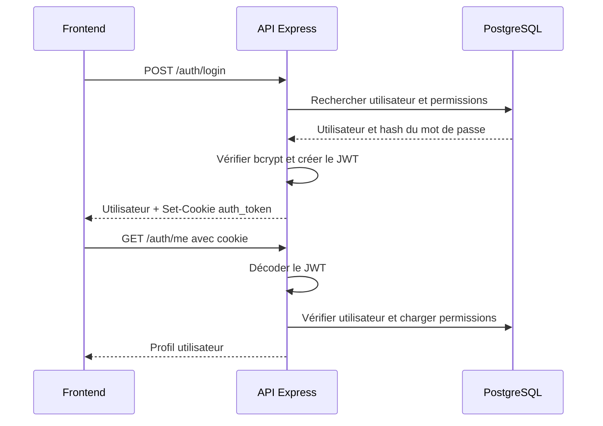
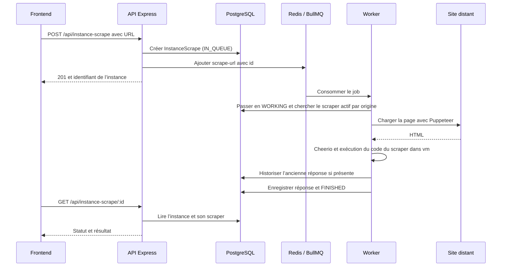
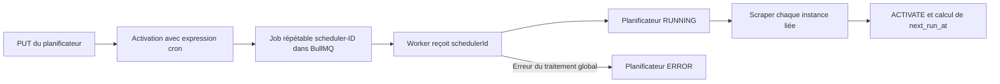

# Flux API : connexion et scraping

## Connexion par cookie

Le cookie est `httpOnly` et devient `secure` en production. `authHandler` accepte également `Authorization: Bearer …` si le cookie est absent. Le frontend transmet les cookies avec `credentials: "include"`.

## Scraping manuel

En cas d’échec, le worker enregistre un historique et une réponse d’erreur avec le statut `ERROR`. Il traite les jobs avec une concurrence de 1.

## Scraping planifié

Une instance créée avec `scrapingSchedulerId` n’est pas mise immédiatement en file. Lors de la désactivation, le contrôleur retire le job répétable. Un échec sur une instance est enregistré puis le traitement des autres continue ; il ne force pas à lui seul le planificateur en `ERROR`.

Sources : [connexion](../../../api/src/controllers/authController.ts), [cookies](../../../api/src/utils/cookieUtils.ts), [instances](../../../api/src/controllers/instanceScrapeController.ts), [planificateurs](../../../api/src/controllers/scrapingSchedulerController.ts), [worker](../../../api/src/worker.ts).

## Changement de mot de passe personnel

`POST /auth/change-password` est disponible pour tout compte authentifié, sans permission métier supplémentaire. `authHandler` identifie l’utilisateur depuis le JWT et la base. Le contrôleur utilise exclusivement `req.user.id` : un identifiant ou un rôle fourni dans le corps ne peut pas changer le compte cible.

Le mot de passe actuel est vérifié avant toute écriture. Le nouveau doit être une chaîne d’au moins 8 caractères et de 72 octets UTF-8 maximum, pour éviter la troncature de bcrypt. Seul le hash est enregistré. Les requêtes sans authentification, avec mot de passe actuel incorrect ou avec saisie invalide sont refusées.

Les routes `GET /api/settings` et `PUT /api/settings/:id` conservent leur middleware administrateur : un compte standard ne peut ni lire la configuration globale ni modifier les secrets OpenRouter ou SMTP, même par appel HTTP direct.
