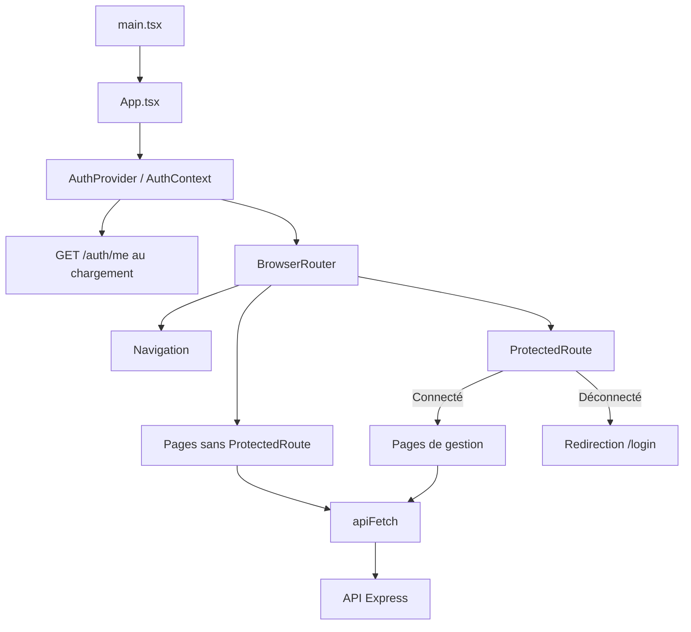

# Architecture du frontend

Le frontend utilise React, TypeScript, React Router, Tailwind et Vite. Les pages sont dans `app/src/`, les composants partagés dans `components/`.

`AuthProvider` expose l’utilisateur, `login`, `logout`, `isAdmin` et `hasPermission` via `useAuth`. Il attend la vérification `/auth/me` avant d’afficher l’application. `ProtectedRoute` vérifie la connexion ; les permissions sont utilisées par les pages et contrôlées côté API.

## Navigation

| Chemin | Page | ProtectedRoute |
| --- | --- | --- |
| `/` | Redirection vers `/dashboard` | Non |
| `/login` | `LoginPage.tsx` | Non |
| `/register` | `RegisterPage.tsx`, inscription par invitation | Non |
| `/admin-auth` | `AdminAuthPage.tsx`, premier administrateur | Non |
| `/document/:id` | `DocumentPage.tsx`, dont lecture publique | Non |
| `/dashboard` | `Dashboard.tsx` | Oui |
| `/scrapers`, `/scraper/:id` | Liste et édition des scrapers | Oui |
| `/instances` | `InstancesScrapePage.tsx` | Oui |
| `/scraping-schedulers`, `/scraping-scheduler/:id` | Liste et édition des planificateurs | Oui |
| `/users`, `/user/:id` | Liste et édition des utilisateurs | Oui |
| `/settings` | Mot de passe personnel ; configuration globale pour les administrateurs | Oui |

## Accès à l’API

`apiFetch` préfixe les chemins avec `VITE_API_URL` (par défaut `http://localhost:3000`), utilise `Content-Type: application/json` et inclut les cookies. L’état métier est principalement local aux pages ; l’authentification est partagée par contexte.

Sources : [entrée](../../../app/src/main.tsx), [routes](../../../app/src/App.tsx), [contexte](../../../app/src/components/AuthProvider.tsx), [protection](../../../app/src/components/ProtectedRoute.tsx), [client HTTP](../../../app/src/api.ts).

## Paramètres personnels et administration

L’icône des paramètres est visible pour tous les utilisateurs connectés. Un compte `USER` voit uniquement le formulaire de changement de mot de passe : aucune requête `/api/settings` n’est envoyée. Les sections Anthropic et SMTP, ainsi que leur chargement, sont réservées à `ADMIN`.

Le formulaire demande le mot de passe actuel et la confirmation du nouveau. Les contrôles de saisie sont également appliqués côté API ; masquer des sections dans le frontend ne remplace pas l’autorisation serveur.
