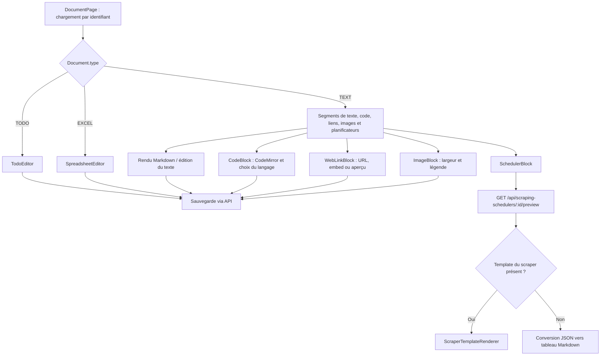
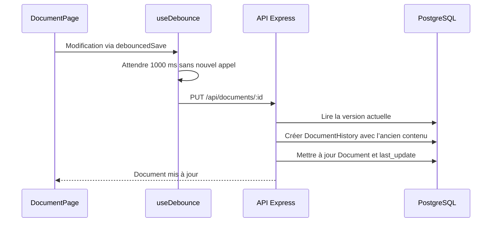

# Édition et affichage des documents

## Choix de l’éditeur



Les trois formats sont stockés dans le champ `Document.text`. Un bloc planificateur est sérialisé sous la forme `::scheduler[42]::` au milieu du texte. `SchedulerBlock` charge son aperçu au montage et quand son identifiant change ; il n’effectue pas de rafraîchissement périodique.

## Blocs de code

La commande `/code` insère un bloc dédié, éditable avec CodeMirror. La barre d’outils en haut à droite propose un langage, la copie de tout le contenu et un menu de suppression. Le langage est enregistré dans la clôture Markdown, par exemple ` ```python `. La coloration est chargée à la demande ; les blocs sans langage restent en texte brut. Les lecteurs peuvent copier le code, mais ne peuvent pas le modifier.

`utils/documentSegments.ts` sépare les blocs clôturés du texte et des planificateurs. Les marqueurs `::scheduler[id]::` dans le code restent littéraux. Les clôtures sont allongées si le contenu contient lui-même une ligne de triples accents graves.

## Liens web

Un lien seul peut être affiché comme URL, embed ou aperçu visuel. Voir [le parcours et le format de sauvegarde](liens-web.md).

## Images locales

La commande `/image` ouvre le sélecteur. Le dépôt de fichiers est disponible à l’intérieur de cette fenêtre. Les fichiers passent par Express et sont stockés localement ; aucun service supplémentaire n’est nécessaire. Voir [upload, accès et sauvegardes](images.md).

## Sous-pages

Une page peut avoir une page parente (`Document.parentId`). La commande `/page` et le « + » de l’arborescence de la sidebar créent une sous-page puis l’ouvrent. Dans une page texte, la sous-page est aussi insérée comme bloc `::page[id]::` ; retirer ce bloc ne supprime pas la sous-page, qui reste listée sous « Sous-pages ». `GET /api/documents/:id` renvoie `ancestors` (fil d’Ariane) et `children` ; le bouton « Déplacer » envoie `parentId` dans `PUT /api/documents/:id`, l’API refusant une page déplacée sous elle-même ou sous une de ses sous-pages. Supprimer une page supprime ses sous-pages.

## Sauvegarde et historique



Un enregistrement encore en attente quand la page est quittée est envoyé immédiatement au lieu d’être perdu. La route `/document/:id` remonte la page à chaque changement de document.

La page consulte aussi `/api/document-histories/:id` pour les anciennes versions et `/api/conversations/:id` pour les échanges IA. Les appels IA passent par `/api/ai-client`.

## Commandes de l’éditeur

`app/src/commands.ts` définit `/page`, `/image`, `/planificateur`, `/scrape`, `/date`, `/time`, `/divider`, `/code`, `/quote`, `/list` et `/checkbox`. `/page` crée une sous-page ; `/image`, `/planificateur` et `/scrape` ouvrent une fenêtre de sélection ou de saisie ; les autres insèrent du texte. `/scrape` crée une instance, interroge son statut périodiquement et exploite le résultat.

Sources : [page document](../../../app/src/DocumentPage.tsx), [bloc de code](../../../app/src/components/CodeBlock.tsx), [segments](../../../app/src/utils/documentSegments.ts), [commandes](../../../app/src/commands.ts), [temporisation](../../../app/src/hooks/useDebounce.ts), [bloc planificateur](../../../app/src/components/SchedulerBlock.tsx), [contrôleur document](../../../api/src/controllers/documentController.ts).
