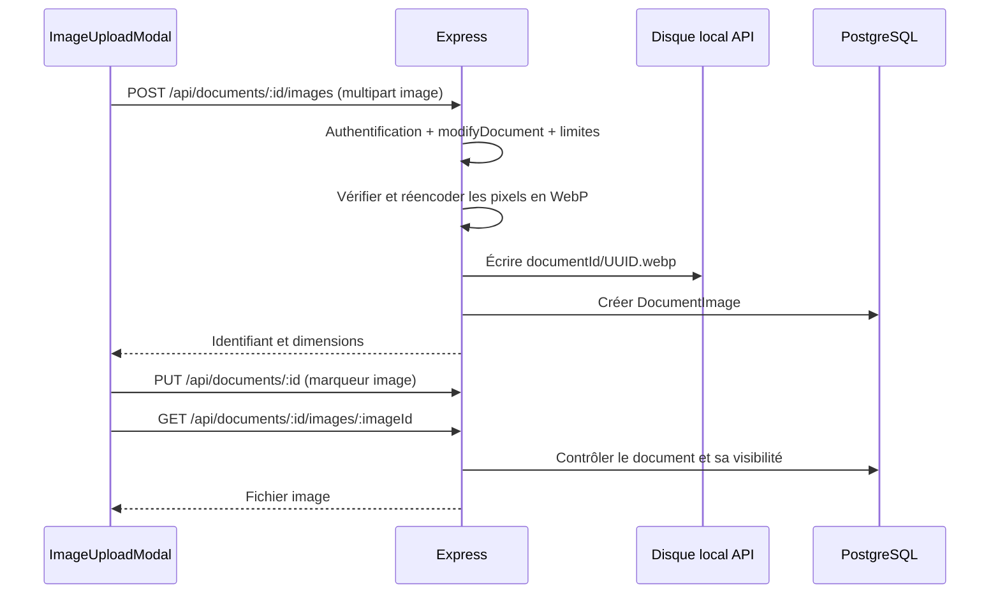

# Images dans les documents texte

## Utilisation

Taper `/image` dans un document texte pour ouvrir le sélecteur de fichiers. Une fois la fenêtre ouverte, sélectionner les fichiers ou les déposer dans sa zone dédiée. La fenêtre accepte jusqu’à 10 fichiers par envoi : JPEG, PNG, WebP et GIF, de 10 Mo maximum chacun. Les échecs sont affichés et peuvent être réessayés sans renvoyer les fichiers déjà insérés.

Chaque bloc permet de choisir une largeur (25, 50, 75 ou 100 %), une légende, d’ouvrir l’image et de la retirer du texte. Les lecteurs ne disposent pas des contrôles de modification.



## Format et cycle de vie

`Document.text` contient un marqueur `::image[JSON-encodé]::`, avec `id`, `caption`, `alt` et `width`. Le frontend reconstruit l’URL à partir du document courant ; aucun chemin de fichier fourni par l’utilisateur n’est utilisé. Les marqueurs dans les blocs de code restent du texte littéral.

Retirer un bloc conserve son fichier pour les anciennes versions de `DocumentHistory`. Supprimer le document via l’API supprime ses métadonnées d’images en cascade et son dossier de fichiers. Un upload terminé sans insertion reste lié au document jusqu’à sa suppression. Une suppression directe en SQL ou via le MCP supprime les métadonnées, mais ne nettoie pas le disque de l’API.

## API et protections

- `POST /api/documents/:id/images` : authentification, permission `modifyDocument`, document `TEXT`, un seul champ fichier `image`.
- `GET /api/documents/:id/images/:imageId` : lecteur connecté ou document public. L’identifiant doit appartenir au document indiqué.
- MIME ou extension déclarés ne suffisent pas : les pixels sont décodés, les formats vectoriels sont refusés et les fichiers sont réencodés sans leurs métadonnées.
- Limites : 10 Mo, 40 millions de pixels, 100 frames, dimensions finales au maximum 4096 × 4096 par frame. Les GIF animés deviennent des WebP animés.
- Les fichiers sont servis avec `nosniff` et `Cache-Control: private, no-store`, afin de contrôler à nouveau l’accès après un changement de visibilité.

## Déploiement et sauvegarde

Après mise à jour du code :

```sh
npm --prefix api ci --legacy-peer-deps
cd api
npx prisma generate
npm run sync-database
npm run dev:api
```

Le changement Prisma ajoute `DocumentImage` sans modifier les colonnes existantes. Le schéma MCP est synchronisé ; régénérer aussi son client si le serveur MCP est utilisé.

Hors Docker, les fichiers vont dans `api/uploads/images` lorsque l’API est lancée depuis `api/`. `IMAGE_STORAGE_PATH` permet de choisir un répertoire persistant accessible en écriture par l’API. En Docker, Compose monte le volume `document-images` sur `/api/uploads/images` ; reconstruire l’API pour installer ses nouvelles dépendances Node. Les fichiers `.env` sont exclus du build ; Compose charge `api/.env` à l’exécution pour l’API et le serveur MCP (Compose 2.24+) ; le worker n’en reçoit pas. Le serveur MCP monte aussi le volume `document-images`, car supprimer une page via MCP supprime ses images.

Sauvegarder **PostgreSQL et le dossier/volume des images ensemble**. Pour plusieurs instances d’API, partager ce dossier entre elles. Si un reverse proxy est utilisé, autoriser un corps multipart légèrement supérieur à 10 Mo (par exemple 12 Mo) ; la limite de fichier reste contrôlée par Express.

Sources : [schéma](../../../api/prisma/schema.prisma), [routes](../../../api/src/routes/documentRoutes.ts), [stockage](../../../api/src/utils/documentImageStorage.ts), [bloc image](../../../app/src/components/ImageBlock.tsx), [Multer](https://expressjs.com/en/resources/middleware/multer/), [Sharp](https://sharp.pixelplumbing.com/api-constructor/), [configuration Compose](https://docs.docker.com/compose/how-tos/environment-variables/set-environment-variables/).
