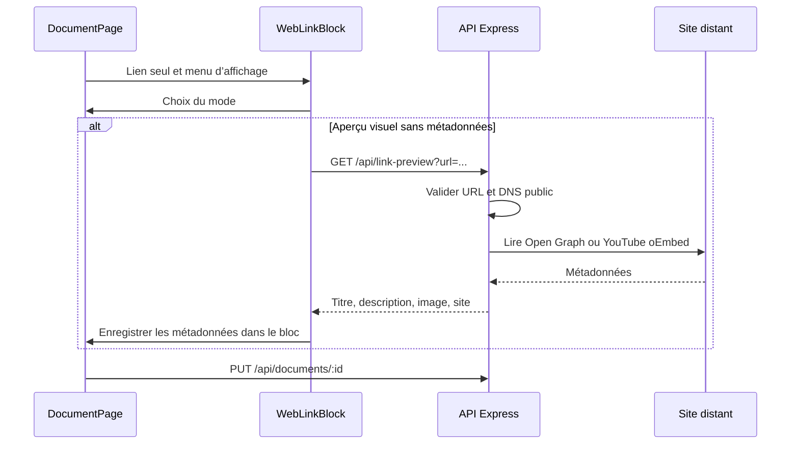

# Liens web, embeds et aperçus

## Choix de l’affichage

Dans un document texte, coller un lien HTTP/HTTPS sur une ligne vide ouvre un menu ancré au lien. Un lien saisi au clavier propose le même menu avec Entrée ou à la fin de l’édition. Un lien au milieu d’une phrase reste du Markdown normal.

| Mode | Affichage |
| --- | --- |
| URL simple | Lien cliquable, ouvert dans un nouvel onglet |
| Intégrer | Vignette YouTube puis lecteur au clic ; iframe pour les autres pages |
| Aperçu visuel | Carte avec titre, description, adresse et image lorsqu’elle existe |

Le menu reste accessible pour changer de mode ou supprimer le bloc. Les lecteurs de documents publics peuvent ouvrir les liens et lire les vidéos ; les modifications sont réservées aux utilisateurs avec `modifyDocument`.

## Parcours

## Persistance

Les blocs sont enregistrés dans `Document.text` sous la forme `::link[JSON encodé par encodeURIComponent]::`. Le JSON contient l’identifiant du bloc, l’URL, le mode et les métadonnées éventuelles. Le contenu est conservé dans l’historique, sans migration de la base. Les aperçus sauvegardés se lisent sans requête API supplémentaire ; ils ne sont pas actualisés automatiquement.

Les URL dans les blocs de code restent littérales. Les liens `watch`, `youtu.be`, `shorts`, `live` et `embed` de YouTube utilisent un lecteur `youtube-nocookie.com`, avec prise en compte du temps de départ. Les iframes sont isolées par `sandbox`. Certains sites refusent l’intégration ; le lien « Ouvrir » et le mode aperçu restent disponibles. Une récupération d’aperçu échouée conserve une carte minimale et permet de réessayer.

L’API refuse les schémas autres que HTTP/HTTPS, les identifiants dans l’URL, les ports non standards et les adresses locales ou privées. Elle fixe l’adresse DNS vérifiée lors de la connexion, revalide les redirections et limite le délai et la taille des réponses.

Sources : [bloc web](../../../app/src/components/WebLinkBlock.tsx), [format des liens](../../../app/src/utils/webLinks.ts), [segmentation](../../../app/src/utils/documentSegments.ts), [route API](../../../api/src/routes/linkPreviewRoutes.ts), [récupération des métadonnées](../../../api/src/utils/linkPreview.ts), [format officiel du lecteur YouTube](https://developers.google.com/youtube/player_parameters).
