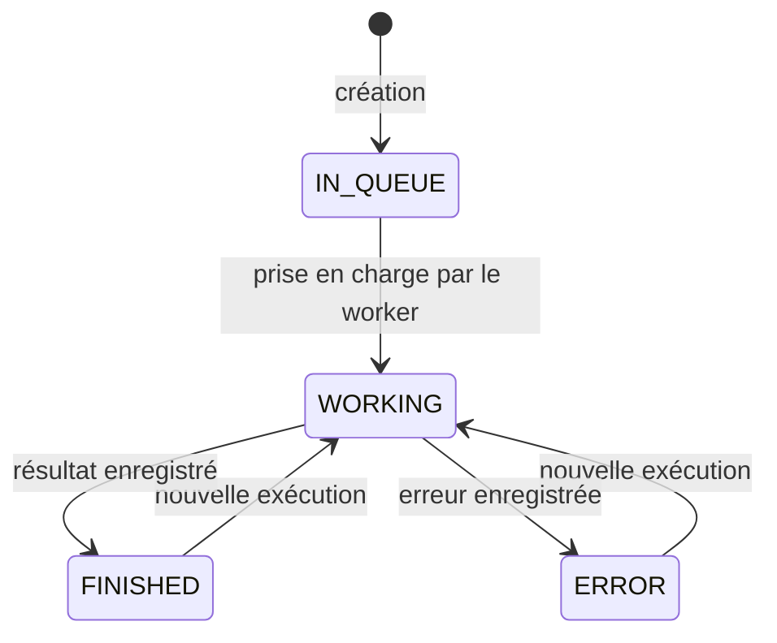

# Modèles et états métier

## Rôle des tables

| Modèle | Responsabilité |
| --- | --- |
| `User` | Compte, mot de passe haché et rôle. |
| `Document` | Contenu TEXT, EXCEL ou TODO, auteur, visibilité, page parente optionnelle (sous-pages) et dossier optionnel (pages racines). |
| `Folder` | Dossier de rangement, éventuellement dans un dossier parent ; sa suppression fait remonter son contenu d’un niveau. |
| `ScrapingScheduler` | Expression cron, activation et dates d’exécution. |
| `DocumentHistory` | Ancien contenu et utilisateur associé à la modification. |
| `Scraper` | Code de scraping, origines autorisées et template de rendu JSON. |
| `InstanceScrape` | URL, résultat JSON courant et statut du scraping. |
| `InstanceScrapeHistory` | Ancien résultat ou erreur enregistré par le worker. |
| `Conversation` | Fil de discussion IA d’un utilisateur, lié à une page ou global ; supprimé avec sa page. |
| `AiMessage` | Message d’une conversation au format chat OpenRouter (utilisateur, assistant, résultat d’outil) et résumé affiché. |
| `UserPermissions` | Droits booléens ; tous désactivés par défaut. |
| `Invitation` | Adresse email, token unique, expiration et utilisation. |
| `Settings` | Clé OpenRouter (chiffrée), modèles texte et image, SMTP, empreinte du token MCP ; l’API utilise la première ligne. |
| `DocumentImage` | Métadonnées d’une image locale, dimensions, taille et document propriétaire ; suppression en cascade. |
| `Images` | Métadonnées : nom et date de création. |

## Valeurs des énumérations

Les valeurs ci-dessous reprennent les noms exacts du schéma, y compris `DESACTIVATE`.

| Énumération | Valeurs |
| --- | --- |
| `DocumentType` | `TEXT`, `EXCEL`, `TODO` |
| `ScrapingSchedulerStatus` | `DESACTIVATE`, `RUNNING`, `ERROR`, `ACTIVATE` |
| `InstanceScrapeStatus` | `IN_QUEUE`, `STARTING`, `WORKING`, `FINISHED`, `ERROR` |
| `ScraperStatus` | `ACTIVE`, `DISABLE` |
| `Role` | `USER`, `ADMIN` |

## États d’une instance

`STARTING` existe dans l’énumération, mais le worker actuel n’effectue pas de transition vers cet état.

## Persistance et initialisation

PostgreSQL 18 est monté sur `/var/lib/postgresql` via le volume `postgres-data`. Redis conserve les jobs BullMQ, pas les documents. Le volume `document-images` conserve les fichiers WebP de l’API ; il doit être sauvegardé avec PostgreSQL. Pour une base locale neuve, lancer `npm --prefix api run sync-database` avant `npm run dev` ; la génération du client Prisma ne crée pas les tables.

Le worker historise une réponse antérieure avant de la remplacer. Les documents sont historisés par le contrôleur lors des mises à jour. Les valeurs `Json`, les textes et les templates ne sont pas normalisés en tables supplémentaires.

Sources : [schéma Prisma](../../../api/prisma/schema.prisma), [Docker Compose](../../../docker-compose.yml), [initialisation des paramètres](../../../api/src/app.ts), [historique document](../../../api/src/controllers/documentController.ts), [worker](../../../api/src/worker.ts).
