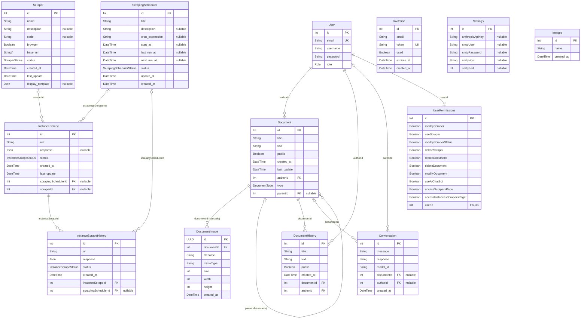

# Tables et relations PostgreSQL

Le schéma Prisma contient 13 modèles. Ce diagramme reprend leurs champs persistés et leurs relations ; les champs de navigation Prisma ne sont pas des colonnes SQL.

## Lecture

- `PK` : clé primaire ; `FK` : clé étrangère ; `UK` : contrainte d’unicité.
- `||` : exactement un ; `|o` / `o|` : zéro ou un ; `o{` : zéro à plusieurs.
- `nullable` : champ optionnel. `String[]` représente un tableau PostgreSQL.
- `UserPermissions.userId` est unique : un utilisateur possède au maximum une ligne de permissions.
- Les liens de `Conversation` vers un utilisateur et un document sont optionnels, comme les liens des instances vers un scraper ou un planificateur.

`Document.parentId` forme l’arborescence des sous-pages (`null` pour une page racine). Supprimer une page supprime toute sa descendance : la base cascade sur `parentId`, et le contrôleur supprime d’abord les historiques et les images de chaque page du sous-arbre.

Les fichiers de `DocumentImage` sont stockés localement par Express, hors PostgreSQL. La relation `documentId` supprime les métadonnées en cascade ; le contrôleur supprime aussi le dossier du document.

`Invitation`, `Settings` et `Images` n’ont aucune clé étrangère. Il n’existe pas de relation SQL entre `Document` et `ScrapingScheduler` : le frontend stocke une référence textuelle `::scheduler[id]::` dans `Document.text`.

Source : [schéma Prisma API](../../../api/prisma/schema.prisma). Le serveur MCP possède également son [schéma Prisma](../../../mcp/prisma/schema.prisma) pour accéder à la même base.
